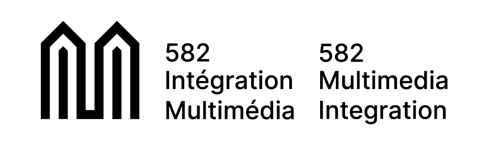

# 👋 Welcome to the 582 Multimedia Repo! 👋

<!-- ## :exclamation: DO TO RIGHT AWAY :exclamation:

[Set up your security questions from the Security info page](https://support.microsoft.com/en-us/account-billing/set-up-security-questions-as-your-verification-method-3d74aedd-88a5-4932-a211-9f0bfbab5de8#:~:text=To%20set%20up%20your%20security%20questions&text)

Due to IT's recent change to phase out the security portal, all access are migrated to Microsoft's security system for login and password recovery. Make sure to do add your security questions to your vanier account **ASAP**. -->

## Quicklinks

[:bulb: Web Best Practices](https://github.com/582Multimedia/web-best-practices)

[:art: Sandbox](https://sandbox.582multi.media/)

## Courses (Current)

[:clapper: Photo & Cinematography](https://github.com/582Multimedia/582-104-va-photo-cinema)

[:raised_hands: Web5: Web Applications](https://github.com/582Multimedia/web5-web-apps)

[:sparkles: Motion Graphics](https://github.com/582Multimedia/motion-graphics/)

## Capyskills

[Capibility.com](https://capibility.com/)

[AI Capy](https://transversal.triangulai.com/)

[AI Capy SMART Goals](https://transversal.triangulai.com/smartgoals/)

[Capyskills grids](https://docs.google.com/spreadsheets/d/18iX7gnHvc09U_KkUmMC8eyVv4WE6quUvTEX9V2TahMQ/edit?gid=146427341#gid=146427341)

## :fr: les échanges en france

You have two possibilities. 
 - a 2-week trip to Lens, near Vimy Ridge, for a multimedia and web project
 - a full semester in the winter at the IUT Vélizy, in Versailles near Paris.

[infos échanges](https://582multi.media/echange/)

## Courses (Past)

<!-- [:card_index: Web4: Database and Content Management](https://github.com/582Multimedia/582-403-va-web4-db-cms) -->

[:wrench: 3D Printing for Creative Problem Solving](https://github.com/582Multimedia/365-htc-va-3d-creative)

[ Web2: CMS & Animation (Bruce)](https://github.com/582Multimedia/web2-cms-animation)

[ Emerging Tech 3: AR & VR (Peter O)](https://github.com/582Multimedia/VR-AR-projects-ws2025/)

## Guides and references

[ Sign Up for GitHub](https://github.com/582Multimedia/GitHub-signup)

[ Git Concepts and Basics](https://github.com/582Multimedia/git-basics)

[ git fundamentals](https://github.com/582Multimedia/web2_cms_animation/blob/main/git_fundamentals.md)

[ Web Best Practices](https://github.com/582Multimedia/web-best-practices)

[ CSS grid fundamentals](https://github.com/582Multimedia/web2_cms_animation/blob/main/CSS-grid-fundamentals.md)

[ Blender](https://github.com/582Multimedia/blender)

[Touch Designer links from Vincent @ SAT](https://github.com/582Multimedia/touch-designer/)

## Links and Recommendations

[ Software Links](https://github.com/582Multimedia/software-links)

[ Hardware recommendations (SSDs)](https://github.com/582Multimedia/hardware-recommendations)

## archived links

[ Web2 homepage details](https://github.com/582Multimedia/web2-homepage)
